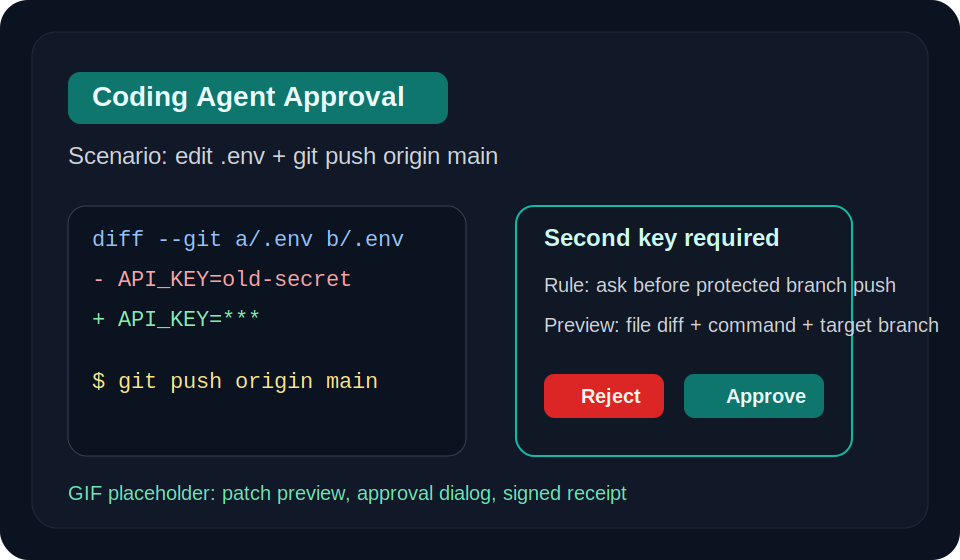
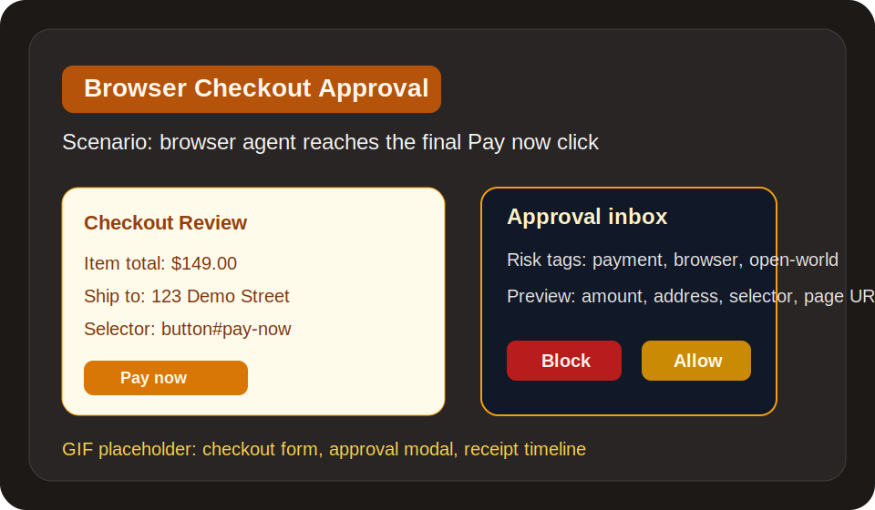
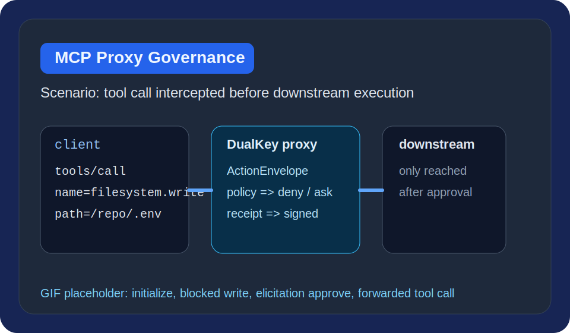
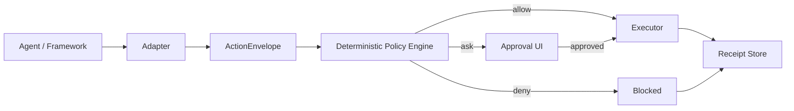

# DualKey

[](https://github.com/wadeKeith/dualkey-agent/actions/workflows/ci.yml)
[](https://github.com/wadeKeith/dualkey-agent/releases)
[](./LICENSE)
[](./pyproject.toml)

No dangerous agent action without a second key.

Add approvals, policy, and receipts to any AI agent in 10 lines.

DualKey is an execution authorization layer for AI agents. It sits between an agent deciding to do something and that action actually running. The goal is simple: standardize risky actions, evaluate them with deterministic policy, require a second key when needed, and leave behind tamper-evident receipts.

## Demos

GIFs are still being recorded. The cards below mark the three public-facing demos the repo is built around:

| Coding agent approval | Browser checkout approval | MCP tool governance |
| --- | --- | --- |
| [](./docs/assets/demo-coding-gate.svg) | [](./docs/assets/demo-browser-checkout.svg) | [](./docs/assets/demo-mcp-proxy.svg) |

## Why this exists

The agent ecosystem already has plenty of planning and orchestration. What it still lacks is a shared control plane for dangerous actions:

- `browser-use` can click through checkout flows.
- coding agents can edit files, run shell commands, and push branches.
- MCP servers expose tools that can reach secrets, production systems, and real money.

DualKey focuses on the missing layer:

- action normalization
- deterministic policy
- approval / denial
- evidence receipts
- replay-ready event history

## Project docs

- [LICENSE](./LICENSE)
- [CHANGELOG.md](./CHANGELOG.md)
- [CONTRIBUTING.md](./CONTRIBUTING.md)
- [SECURITY.md](./SECURITY.md)
- [CODE_OF_CONDUCT.md](./CODE_OF_CONDUCT.md)
- [RELEASING.md](./RELEASING.md)

## What the MVP ships

- A minimal Python SDK with a deterministic policy engine.
- A console approval flow for high-risk actions.
- A real stdio MCP proxy that intercepts `tools/call`.
- A Claude Code hook adapter for `PreToolUse`, `PermissionRequest`, and post-tool receipts.
- A browser-use adapter that wraps `registry.execute_action`.
- An OpenHands adapter that wraps `ToolExecutor.__call__()` and aligns native confirmation receipts with executor receipts.
- HMAC-signed receipts with JSONL or SQLite storage, plus built-in redaction and retention knobs.
- A `dualkey-receipts` query CLI for trace and audit lookups.
- Three runnable demo scenarios:
  - coding agent tries to write `.env` and push `main`
  - browser agent tries to click `Pay now`
  - shell agent tries to run `rm -rf`

## Quickstart

Install the Python package in editable mode:

```bash
python3 -m pip install -e .
```

Create a policy file:

```yaml
default_decision: ask
rules:
  - id: safe_docs_reads
    when:
      intent: read
      target_prefix: /repo/docs/
    decision: allow

  - id: dangerous_shell_requires_second_key
    when:
      tool: shell.exec
      command_matches: ["git push", "rm -rf", "npm publish"]
    decision: ask

  - id: secrets_and_money_are_blocked
    when:
      tags_any: ["secrets", "payment", "prod"]
    decision: deny
```

Dry-run one action against that policy before wiring it into an agent:

```bash
printf '%s\n' '{"actor":"openhands","surface":"shell","tool":"shell.exec","intent":"execute","args":{"command":"git push origin main"}}' \
  | dualkey-policy eval --policy policy/examples/dualkey.yaml
dualkey-policy test --policy policy/examples/dualkey.yaml --cases policy/examples/dualkey-tests.yaml
```

The repo ships matching fixture files for every example policy under `policy/examples/*-tests.yaml`, and CI runs them on every push / PR.
CI also runs `python scripts/verify_smoke.py` so `dualkey-verify` has to keep catching both valid and tampered stores / bundles at the CLI level.

Wrap an agent:

```python
from dualkey import protect

agent = protect(agent, policy="policy/examples/dualkey.yaml")
agent.run("fix the bug and open a PR")
```

Run the built-in demos:

```bash
dualkey-demo git-push --auto-approve
dualkey-demo payment
dualkey-demo dangerous-shell
```

For local demos, the default `.jsonl` receipt files stay human-readable. If you want append-safe storage plus indexed query fields for `trace_id`, `action_hash`, `status`, and `decision`, point any `receipts_path` or `--receipts` flag at a `.sqlite`, `.sqlite3`, or `.db` file instead.

Receipt hygiene is now configurable without changing adapter code:

```bash
export DUALKEY_RECEIPT_RETENTION_DAYS=30
export DUALKEY_RECEIPT_MAX_RECEIPTS=10000
# optional: keep raw previews and errors
export DUALKEY_RECEIPT_REDACTION=off
```

If you are embedding DualKey as a library instead of a CLI, pass the same knobs explicitly:

```python
from dualkey import ReceiptSettings, guard_openhands_conversation

guard_openhands_conversation(
    conversation,
    policy="policy/examples/openhands.yaml",
    receipt_settings=ReceiptSettings(retention_days=30, max_receipts=10000),
)
```

The CLI surfaces expose the same controls directly: `--receipt-redaction on|off`, `--receipt-retention-days N`, and `--receipt-max-receipts N`.

To inspect one action chain after the fact:

```bash
dualkey-receipts .dualkey/openhands-receipts.sqlite --trace-id openhands:call_pending_1
dualkey-receipts .dualkey/mcp-proxy-receipts.sqlite --status blocked --format json
dualkey-receipts .dualkey/openhands-receipts.sqlite --trace-id openhands:call_pending_1 --format timeline
dualkey-receipts .dualkey/openhands-receipts.sqlite --trace-id openhands:call_pending_1 --format markdown --output ./audit-report.md
dualkey-receipts .dualkey/openhands-receipts.sqlite --trace-id openhands:call_pending_1 --format bundle --output ./audit-bundle
dualkey-replay ./audit-bundle --trace-id openhands:call_pending_1
dualkey-replay ./audit-bundle --trace-id openhands:call_pending_1 --tool bash --target-contains .env
dualkey-replay ./audit-bundle --trace-id openhands:call_pending_1 --metadata-path workspace.root --metadata-contains /repo --show-metadata
dualkey-replay ./audit-bundle --trace-id openhands:call_pending_1 --format html --output ./audit-view.html --show-metadata
dualkey-verify ./audit-bundle
dualkey-verify .dualkey/openhands-receipts.sqlite --format json
```

The HTML viewer is static and self-contained. It now includes client-side search, exact filters for status/decision/actor/surface/tool/risk, metadata visibility toggles, and trace expand/collapse controls.
`dualkey-verify` checks receipt HMACs, bundle manifest signatures, and exported artifact hashes so a shared audit bundle can be validated after export.
The repo also ships `scripts/verify_smoke.py`, which generates valid and tampered fixtures and asserts the CLI returns the expected success / failure codes.
To render the same Markdown checklist CI uses as a release gate:

```bash
python3 scripts/package_smoke.py
python3 scripts/release_gate.py
python3 scripts/release_gate.py --status passed --output ./release-gate.md
python3 scripts/release_gate.py --format issue-template --output ./.github/ISSUE_TEMPLATE/release-checklist.md
```

Run a real MCP server through DualKey:

```bash
dualkey-mcp-proxy \
  --policy /absolute/path/to/policy/examples/mcp-proxy.yaml \
  -- \
  python3 /absolute/path/to/server.py
```

To smoke the installed proxy CLI against the included fake MCP server:

```bash
python3 scripts/mcp_proxy_smoke.py
```

Run the Claude Code hook adapter:

```bash
dualkey-claude-hook \
  --policy /absolute/path/to/policy/examples/claude-code.yaml
```

To smoke the installed hook CLI locally:

```bash
python3 scripts/claude_hook_smoke.py
```

Wrap `browser-use` tools in the same policy layer:

```python
from browser_use import Agent, ChatBrowserUse, Tools
from dualkey import guard_browser_use_tools

tools = Tools()
guard_browser_use_tools(
    tools,
    policy="policy/examples/browser-use.yaml",
    approval_mode="tty",
)

agent = Agent(
    task="buy the cheapest red mug",
    llm=ChatBrowserUse(),
    tools=tools,
)
```

To run the real `browser-use` compatibility smoke locally, install the optional dependency set:

```bash
python3 -m pip install -e '.[browser-use]'
python3 -m pytest -q tests/test_browser_use_runtime_compat.py
```

Wrap an OpenHands conversation so native confirmation events and executor receipts stay aligned:

```python
from openhands.sdk import Agent, Conversation, Tool
from dualkey import guard_openhands_conversation

agent = Agent(
    llm=llm,
    tools=[
        Tool(name="TerminalTool"),
        Tool(name="FileEditorTool"),
    ],
)

conversation = Conversation(agent=agent, workspace=".")

guard_openhands_conversation(
    conversation,
    policy="policy/examples/openhands.yaml",
    approval_mode="tty",
)

conversation.run()
```

## Core action model

Every framework-specific tool call is mapped into the same envelope:

```json
{
  "actor": "claude-code",
  "surface": "mcp",
  "tool": "filesystem.write",
  "intent": "write",
  "target": "/repo/.env",
  "args": {
    "path": "/repo/.env",
    "content_preview": "***"
  },
  "risk": ["secrets", "write", "critical-file"],
  "session_id": "sess_123",
  "trace_id": "trace_456"
}
```

DualKey treats MCP, browser, shell, git, and email as different surfaces that collapse into one decision pipeline.

## Architecture



## MCP Proxy

`dualkey-mcp-proxy` is the first real execution-surface integration in the repo. It sits in front of a stdio MCP server, intercepts `tools/call`, maps the call into an `ActionEnvelope`, evaluates policy, and then either:

- blocks the tool call with a structured tool error result
- asks for a second key via MCP `elicitation/create`
- forwards the tool call and records the downstream result

This means DualKey can protect existing MCP servers without requiring changes inside the server itself.

The proxy now also derives per-session context from the real MCP handshake. After `initialize`, tool-call envelopes carry a session shaped by the actual client and server names, plus metadata such as client/server info, negotiated protocol versions, downstream command, request id, and tool schema hints.

The `--receipts` flag can now target either newline JSON or SQLite. A path like `.dualkey/mcp-proxy-receipts.sqlite` keeps the full signed payload while also indexing core fields for audit queries.
CI now also runs `scripts/mcp_proxy_smoke.py`, which drives the installed `dualkey-mcp-proxy` CLI through `initialize`, `tools/list`, a blocked tool call, and an approval via `elicitation/create`.

## Claude Code Hook

`dualkey-claude-hook` maps Claude Code hook payloads into the same `ActionEnvelope` model used by the demo SDK and MCP proxy. It can:

- return `allow | deny | ask` during `PreToolUse`
- auto-allow or auto-deny `PermissionRequest` events when policy is deterministic
- let Claude keep the native prompt when policy resolves to `ask`
- append receipts for `PostToolUse`, `PostToolUseFailure`, and `PermissionDenied`

See [docs/claude-code-hook.md](./docs/claude-code-hook.md) for setup and [docs/policy-language.md](./docs/policy-language.md) for the expanded matcher language.
CI now also runs `scripts/claude_hook_smoke.py`, which exercises the installed `dualkey-claude-hook` binary with both deny and allow payloads.
After the core and adapter jobs pass, CI also renders and uploads a `release-gate` Markdown artifact summarizing every enforced check.

## browser-use Adapter

`guard_browser_use_tools()` wraps `browser-use` at the action registry boundary. It intercepts `registry.execute_action`, maps each action into an `ActionEnvelope`, evaluates the same deterministic policy used by the MCP proxy and Claude Code hook, and then either:

- blocks the action with an `ActionResult(error=...)`
- asks for a second key through the console approver
- forwards the action and writes an execution receipt

This keeps the integration narrow: no fork of `browser-use`, no new planner, just a control layer at the real action surface.

See [docs/browser-use-adapter.md](./docs/browser-use-adapter.md) for setup and [policy/examples/browser-use.yaml](./policy/examples/browser-use.yaml) for a starter policy.

## OpenHands Adapter

`guard_openhands_agent()`, `guard_openhands_tools()`, and `guard_openhands_conversation()` wrap OpenHands without replacing agent planning. The adapter targets the documented `Action -> Observation` tool boundary and intercepts `ToolExecutor.__call__()` for:

- shell execution through `TerminalTool` / `BashTool`
- file reads and edits through `FileEditorTool`
- git operations detected either via explicit git tools or git subcommands issued through the terminal

When you guard a `Conversation`, DualKey also watches native confirmation state transitions and writes conversation-level receipts for:

- `openhands_confirmation_waiting`
- `openhands_confirmation_approved`
- `openhands_confirmation_rejected`

These receipts are aligned with the later executor receipt through the same `trace_id` and `action_hash`, so approval or rejection at the conversation layer and execution or block at the tool layer stay tied to one action record. OpenHands receipts now also derive `session_id` and metadata from the real conversation object, including conversation id, workspace path, and persistence dir when available.

To run the real OpenHands SDK integration tests, install the optional dependency set:

```bash
python3 -m pip install -e '.[openhands]'
python3 -m pytest -q tests/test_openhands_sdk_integration.py
```

Because upstream `openhands-sdk` currently requires Python 3.12+, the OpenHands compatibility job in CI runs on Python 3.12 even though the core package still supports Python 3.11+.

See [docs/openhands-adapter.md](./docs/openhands-adapter.md) for setup and [policy/examples/openhands.yaml](./policy/examples/openhands.yaml) for a starter policy.

## First demos

### 1. Coding agent push to `main`

The agent edits `.env`, then tries `git push origin main`. DualKey shows the patch and command preview, requires a second key, and writes a receipt with the matched rule.

### 2. Browser agent clicks `Pay now`

The agent fills the cart and shipping form, then pauses on the payment click. DualKey shows amount, address, button text, and page target before approval.

### 3. Shell agent hits a hard deny

The agent proposes `rm -rf /tmp/demo`. DualKey denies it immediately based on policy and records the denial.

## Design principles

- Deterministic decisions. Another LLM should not decide whether a dangerous action is allowed.
- Preview first. Users should see what will happen before it happens.
- Small policy language. Five-minute setup matters more than maximum expressiveness.
- Cross-ecosystem by default. The point is to sit across agent runtimes, not replace them.
- Receipts as product surface. Security, debugging, compliance, and replay all depend on evidence.

## Repository layout

```text
DualKey/
├── docs/
│   ├── claude-code-hook.md
│   ├── mcp-proxy.md
│   ├── browser-use-adapter.md
│   ├── openhands-adapter.md
│   ├── policy-language.md
│   └── prd-git-push-approval.md
├── policy/
│   └── examples/
│       ├── claude-code.yaml
│       ├── browser-use.yaml
│       ├── dualkey.yaml
│       ├── mcp-proxy.yaml
│       └── openhands.yaml
├── sdk/
│   └── python/
│       └── src/
│           └── dualkey/
│               ├── __init__.py
│               ├── approvals.py
│               ├── browser_use_adapter.py
│               ├── claude_hook.py
│               ├── demo.py
│               ├── engine.py
│               ├── mcp_proxy.py
│               ├── models.py
│               ├── openhands_adapter.py
│               ├── policy.py
│               └── receipts.py
├── tests/
│   ├── fixtures/
│   │   └── fake_mcp_server.py
│   ├── test_browser_use_adapter.py
│   ├── test_claude_hook.py
│   ├── test_demo.py
│   ├── test_mcp_proxy.py
│   ├── test_openhands_adapter.py
│   └── test_policy.py
```

## Status

This repo is intentionally narrow in v0.1. It proves the core contract: standardize action inputs, decide with deterministic rules, request a second key when needed, and leave behind signed receipts.
